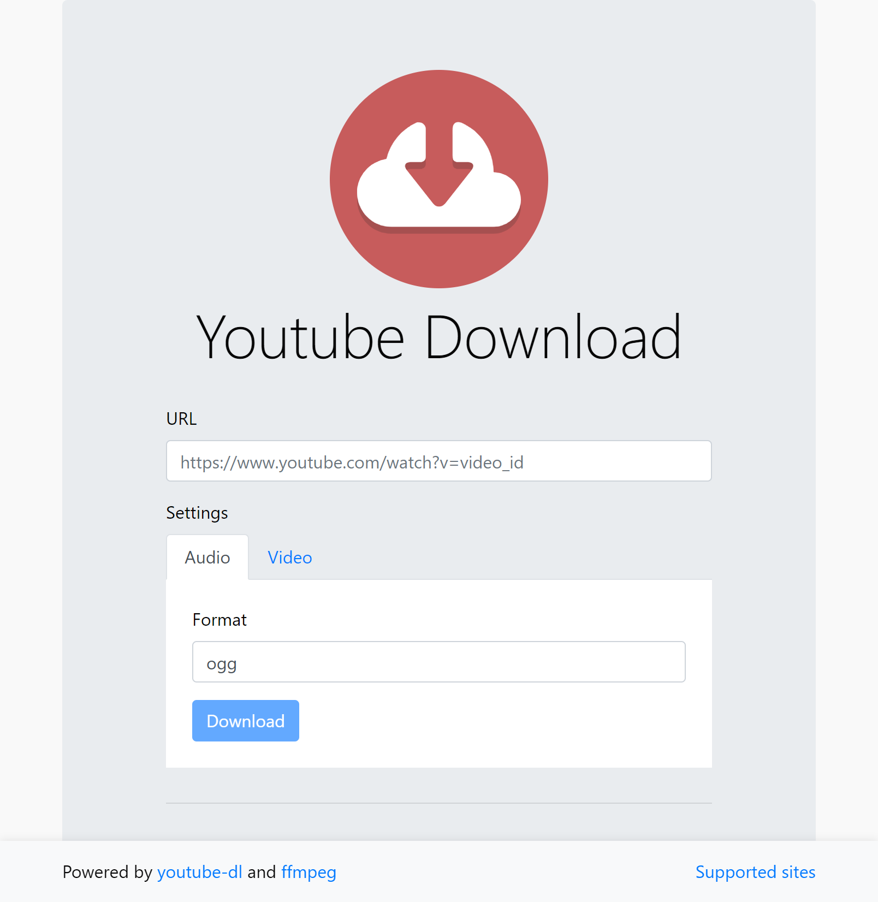

# Youtube Download

A web server for downloading media. Docker ready.



# Supported Sites

This app capable of downloading from many websites including (but not limited to): 
* Bandcamp
* BBC iPlayer
* Crunchy Roll
* Dailymotion
* Disney
* MixCloud
* Soundcloud
* Twitch
* Vimeo
* YouTube

# Docker

This app is available for download as a [docker image](https://hub.docker.com/r/marksfrancis/ytdl-webserver).

### docker cli
```sh
docker run -p 3000:3000 marksfrancis/ytdl-webserver
```

### docker-compose
```yml
version: "3.8"
services:
  ytdlwebserver:
    ports: 
      - "3000:3000"
    image: marksfrancis/ytdl-webserver
```

# Special Thanks

This project is made possible thanks to a wide combination of projects, but we'd like to give special thanks to the following projects in particular:
* [youtube-dl](https://yt-dl.org/)
* [ffmpeg](https://ffmpeg.org/)
* [Algram's ytdl-webserver](https://github.com/Algram/ytdl-webserver)

# Contributing

You'll need the following:
* [Git](https://git-scm.com/downloads)
* [NodeJS](https://nodejs.org/)
* Yarn (install with `npm i -g yarn`)
* [Docker Desktop](https://www.docker.com/products/docker-desktop)

Once you've installed the above, run the following to get started:
```sh
git clone https://github.com/MarkSFrancis/ytdl-webserver.git
cd ytdl-webserver
yarn
yarn start
```

# Legal Notice

This app should only be used to download content that _you_ own. Downloading other content is against YouTube's terms of service, and likely any other sites you're downloading from. Always check the terms and conditions before using this app.
